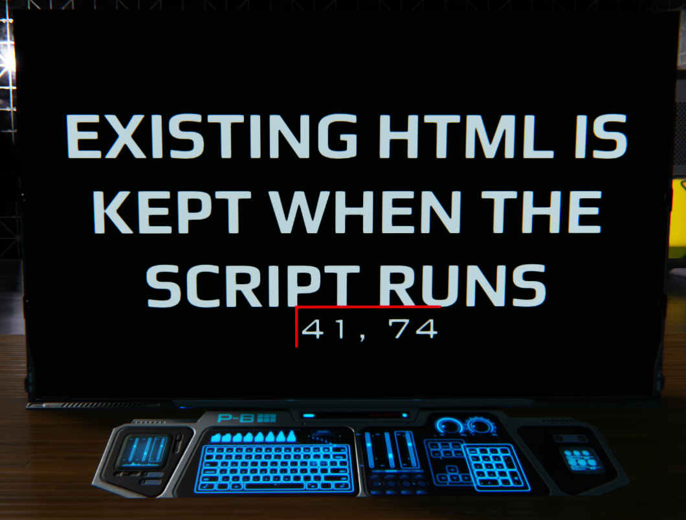

# Coord Finder
## Description
A Dual Universe script for easily finding coordinates for your touch screen scripts.

## Installation
1. Copy the contents of json.txt.
2. Right click on a Programming Board and choose Paste from the Advanced menu
3. Link a screen to the Programming Board
4. Paste or otherwise create a static copy of your UI's HTML on the screen
5. Turn on the board and click somewhere. The coordinates should appear over your UI. Clicking again will move the coordinate overlay and update the coordinates appropriately
6. Turn off the board before leaving the area to clear the coordinates if you plan on using it again. Otherwise you'll need to manually remove the coordinate DIV from the HTML